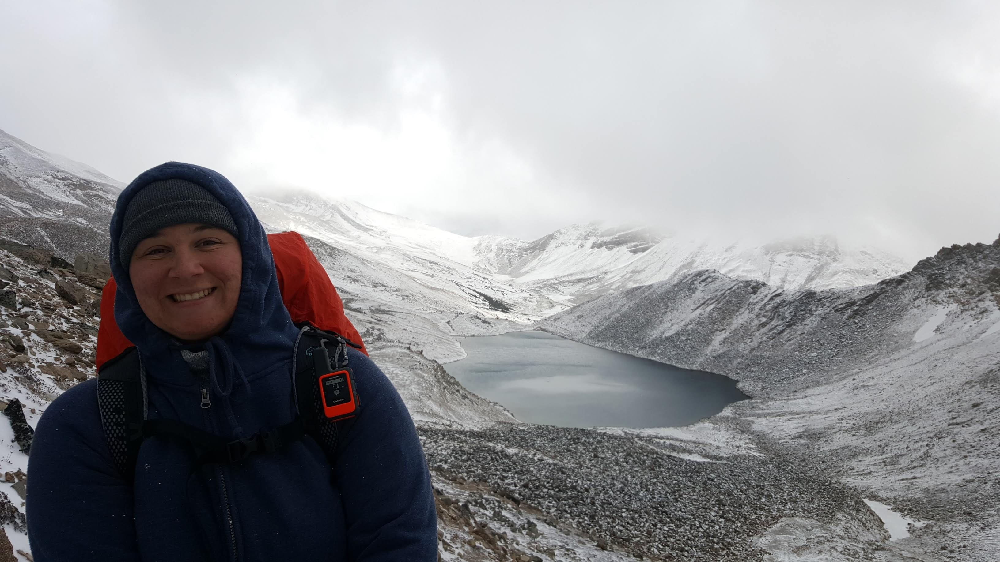

I'm a new grad primarily working on applying data science to enable scientific discoveries in space and the field of particle physics. 

Currently, I work as a **Machine Learning Architect** student at TRIUMF, a national lab in Canada that focuses on particle and nuclear physics. Specifically, I work for ALPHA, the leading antimatter collaboration in the world and on an experiment called ALPHA-g which is located at CERN and is attempting to measure if antimatter reacts the same way to gravity as normal matter. These measurements are potentially of big consequence to our model of the universe and require an incredible amount of accuracy and precision. I collaboratively develop machine learning models that are able to reconstruct these antimatter events better than the state-of-the-art method and therefore can lead us towards new discoveries and our goal of measuring the weight of antimatter quarks. 

I'm also highly interested in data-driven policy and international security, which has led me to working with some awesome teams within the Government of Canada.

One of my biggest hobbies is sailing and so I've dedicated a whole page to it on this website that you should go check out!

## Built With
[![markdown][markdown]][markdown-url]
[![js][js]][js-url]
[![html][html]][html-url]
[![css][css]][css-url]
[![yaml][yaml]][yaml-url]
[![github][github]][github-url]

[github]: https://img.shields.io/badge/github-%23121011.svg?style=for-the-badge&logo=github&logoColor=white
[github-url]: https://github.com/

[vscode]: https://img.shields.io/badge/Visual%20Studio%20Code-0078d7.svg?style=for-the-badge&logo=visual-studio-code&logoColor=white
[vscode-url]: https://code.visualstudio.com/

[markdown]: https://img.shields.io/badge/markdown-%23000000.svg?style=for-the-badge&logo=markdown&logoColor=white
[markdown-url]: https://daringfireball.net/projects/markdown/

[html]: https://img.shields.io/badge/html5-%23E34F26.svg?style=for-the-badge&logo=html5&logoColor=white
[html-url]: https://whatwg.org/

[yaml]: https://img.shields.io/badge/yaml-%23ffffff.svg?style=for-the-badge&logo=yaml&logoColor=151515
[yaml-url]: https://yaml.org/

[js]: https://img.shields.io/badge/javascript-%23323330.svg?style=for-the-badge&logo=javascript&logoColor=%23F7DF1E
[js-url]: https://www.javascript.com/

[css]: https://img.shields.io/badge/css3-%231572B6.svg?style=for-the-badge&logo=css3&logoColor=white
[css-url]: https://www.w3.org/TR/CSS/#css

And all made possible in due to the lovely template provided by [academicpages](https://github.com/academicpages/academicpages.github.io).