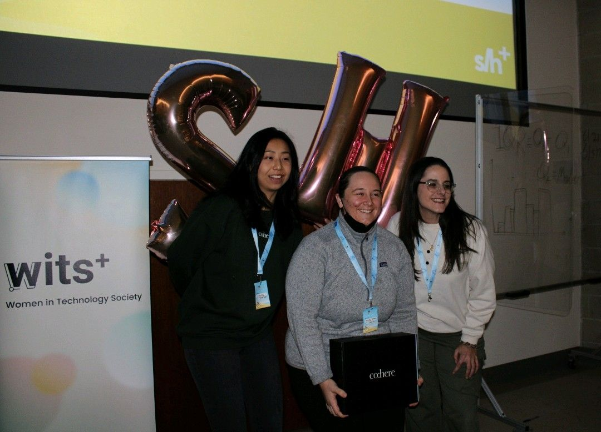



# General Awards

* University of Waterloo Science IDEAL Scholar Cobalt Medal (2024)
    * "IDEAL Scholars are graduating undergraduate students who participated in activities that go above and beyond their course load during their undergraduate degrees."
    * One of the 8 inaugural students from my graduating class to be awarded the highest level of the IDEAL (Innovation, Discovery, Engagement, Application, and Leadership) Scholar medallion

* Digital Government Community Award for Excellence in Data and Information Stewardship (2024, awarded to team I was part of)
    * "This award recognizes an individual or group for outstanding achievement in data and information stewardship"
    * Specifically awarded to Alouette-1 project contributors at the CSA which was the prodominent project I worked on during my time there

## Fellowships & Scholarships

* Centre for International Governance Innovation Digital Policy Hub Fellowship (2024)

* CERN Summer Studentship (2024, declined)
    * Selected as one of ~150 students from over 10,000 applicants to study and work at CERN

* Zenith Pathways Canada Fellowship (2024)
    * "Applicants from 24 institutions across North America underwent a rigorous selection process [...]. The Zenith Fellows were selected for their outstanding commitment to community service, excellent leadership and technical skills, and passion for contributing to the Canadian space sector."

* TRIUMF Richard E. Azuma Fellowship (2023)
    * "intended to support promising undergraduate students in Canada who are considering a career in research fields associated with TRIUMF’s science program.  They will be students who are **known amongst peers and teachers as exceptional individuals with a demonstrated track record of talent, passion, and leadership**. The Azuma Fellowship is seeking not only students with stellar undergraduate records, but also those with diverse backgrounds, collaborative spirit, creativity, and other attributes that will set them apart as future researchers."

* NSERC-CREATE New Technologies for Canadian Observatories Training Program (2021 & 2023)

## Top Presentations

* 1st Place Talk at Canadian Astroparticle Summer Student Talk Competition hosted by SNOLAB & McDonald Institute (2023) 

* 1st Place Oral Presentation in Particle Physics Group at Canadian Conference for Undergraduate Women in Physics 2024

* 2nd Place Poster Presentation in Astrophysics and Cosmology Group at Canadian Conference for Undergraduate Women in Physics 2024

* Best Presentation Award for Team Canada at US Joint Special Operations Command 2021 Data Challenge (2021, awarded to team I was one of presentors for)

## Hackathons

* 1st Place Overall for Galaxy Hunters at Space Apps 2022 Canadian Space Agency Moonwalker Challenges (2023, awarded to team I was lead of)

* 2nd Place for Best Use of Prompt Engineering from Cohere at SheHacks+7 (2023)

## Conference Travel 

* Conference on Computer Vision and Pattern Recognition (CVPR) DEI funding to participate in CVPR 2024

* SNOLAB & McDonald Institute funding to participate in 2024 Canadian Association of Physicists Congress

* University of Waterloo funding to participate in: 
    * Canadian Undergraduate Physics Conference 2022
    * Canadian Undergraduate Physics Conference 2023
    * Canadian Conference for Undergraduate Women in Physics 2024

## Fully Funded Summer Schools

* Astromatic 2022 run by the Ciela Institute
    * "the first edition of a week-long undergrad hackathon combining machine learning and astrophysics. 15 outstanding undergraduate students from 8 different countries"

* Canadian Astroparticle Physics Summer School 2021 run by the McDonald Institute

Awards given to me individually unless otherwise noted.