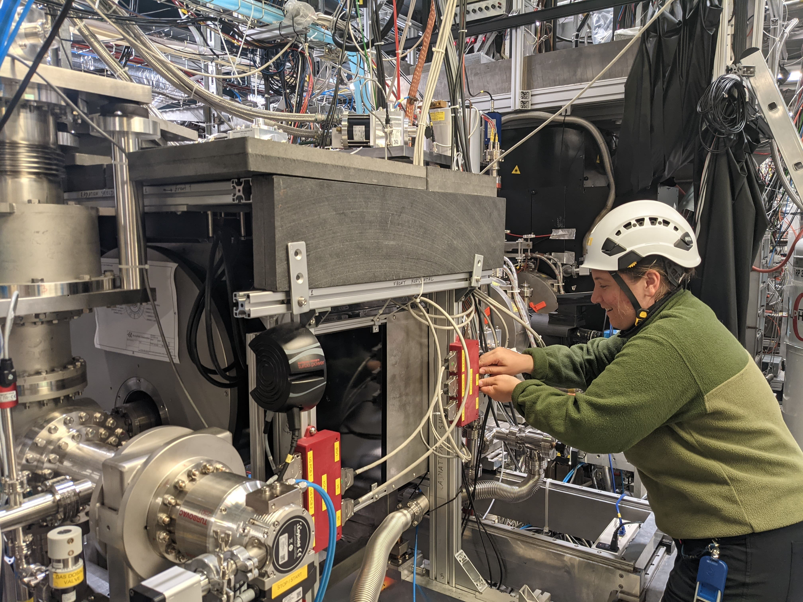



## Government of Canada - 3.5 years

* Junior Data Scientist @ Canadian Space Agency (01/2023 - Present)

* Data Scientist / Analyst @ Global Affairs Canada (05/2022 - 01/2023)

* Student Researcher @ Herzberg Astronomy & Astrophysics Research Centre (09/2021 - 04/2022)

* Defence Data Science Assistant @ Defence Research and Development Canada (01/2021 - 04/2021)

* Renewable Energy Data Research Assistant @ CanmetENERGY (09/2020 - 12/2020)

## TRIUMF: Canada’s Particle Accelerator Center - 1 year

* Incoming: Machine Learning Architect Student @ Particle Physics Group

* Research Student @ Particle Physics Group (05/2023 - 01/2023) 

* Photosensor Detector Researcher @ Particle Physics Group (01/2020 - 04/2020) 

  

  

    
  

  

    
  

  

  

    
  

  

    
  

## Notes

Most of this work experience was gained through the University of Waterloo co-op program, where we would alternate between school and work for our entire degree. This also included a 4-month work experience as a Robotics & Space Operations Intern @ MDA. You can learn more about my co-op work experiences through an [article](https://uwaterloo.ca/co-operative-education/blog/post/co-op-time-try-things) the University of Waterloo co-op prgram wrote about me.