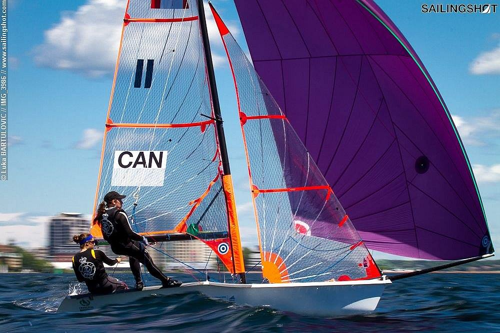

## Royal Canadian Yacht Club - 3.5 years

* Race Management Supervisor (05/2021 - 10/2021)
    * Oversaw racing operations for 35 sailing events including Canada’s Cup and WASZP Canadians
    * Learned many aspects of race management and course setting under challenging conditions

* 29er Crew @ High Performance Race Team  (09/2015 - 08/2018)
    * Selected for Ontario Provincial Sailing Team (2015-2018)
    * Top Female & 3rd overall at 29er Canadian Championship (2017)
    * Top Female & 3rd overall at Canadian Double-handed Youth Championship (2017)
    * Represented Canada at 29er World Championship (2017)
    * Best Female Performance at Royal Candian Yacht Club’s Junior Club Award Ceremony (2018)

  

    

      
    

    

      
    

    

      
    

    

      
    

    

      
    

    

      
    

    <!-- Add more carousel items as needed -->
  

  <a class="carousel-control-prev" href="#slideshow" role="button" data-slide="prev">
    
    Previous
  </a>
  <a class="carousel-control-next" href="#slideshow" role="button" data-slide="next">
    
    Next
  </a>

To learn more visit my old sailing [FaceBook page](https://www.facebook.com/SophAndAsh/)

## Central Okanagan Sailing Association - Summer 2019

* Senior Sailing Instructor & Race Team Coach (05/2019 - 08/2019)

## Collegiate Sailing - 8 Months

* Crew @ Canadian Collegiate Sailing National Keelboat Development Team (10/2023 - Present)

* Skipper @ University of British Columbia Sailing Team (09/2023 - Present)

To learn more check out the UBC Sailing ____ tsc, insta
