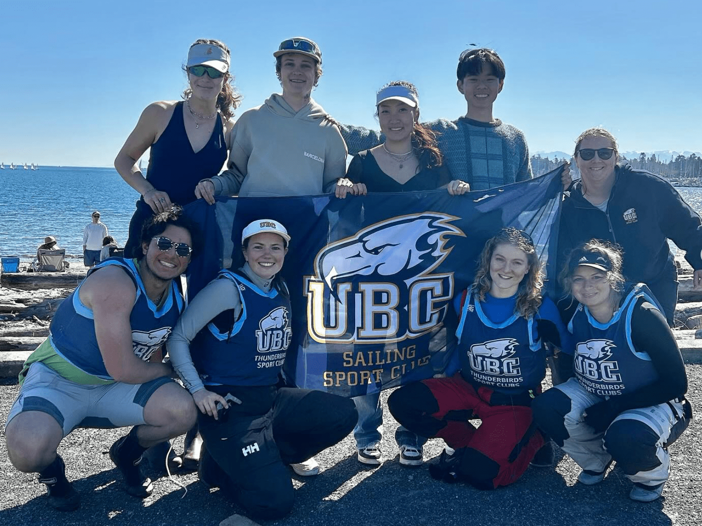

## Royal Canadian Yacht Club - 3.5 years

* Race Management Supervisor  
  

    
 <strong>Sailing Office</strong> | 05/2021 - 10/2021

    

    <ul>
      <li>Oversaw racing operations for 35 sailing events including nation and international level events such as Canada’s Cup and the WASZP Canadian Championship.</li>
      <li>Learned many aspects of race management and course setting under challenging conditions.</li>
    </ul>
  

* 29er Crew   
  

    
 <strong>High Performance Race Team</strong> | 09/2015 - 08/2018

    

    <ul>
      <li>Selected for Ontario Provincial Sailing Team (2015-2018)</li>
      <li>Top Female & 3rd overall at 29er Canadian Championship (2017)</li>
      <li>Top Female & 3rd overall at Canadian Double-handed Youth Championship (2017)</li>
      <li>Represented Canada at 29er World Championship (2017)</li>
      <li>Best Female Performance at Royal Candian Yacht Club’s Junior Club Award Ceremony (2018)</li>
    </ul>
  

To learn more visit my old sailing [Facebook page](https://www.facebook.com/SophAndAsh/).

## Collegiate Sailing - 8+ months

* Honourary Team Member  
  

    
 <strong>University of British Columbia Sailing Team</strong> | 09/2023 - 08/2024

    
Sailed boats with UBC students (while technically not a UBC student, but UWaterloo doesn't have a team so I was allowed to compete with UBC).

  

* Crew  
  

    
 <strong>Canadian Collegiate Sailing National Keelboat Development Team</strong> | 10/2023 - Present

    
Sailed boats with some of the best college students from across Canada.

  

To learn more check out the UBC Sailing Team's [Instagram](https://www.instagram.com/ubcsailing/) or the UBC Thunderbird Sports Club's [Instagram](https://www.instagram.com/ubctsc/?hl=en).

## Miscellaneous
* Senior Sailing Instructor & Race Team Coach  
  

    
 <strong>Central Okanagan Sailing Association</strong> | 05/2019 - 08/2019

    
Had an amazing summer out in Kelowna teaching sailing to disabled and able-bodied people from 4-year to 70-year-olds and further developping the opti and laser youth race program.

  

* Dock Help  
  

    
 <strong>Disabled Sailing Association of Ontario</strong> | 06/2015 - 09/2016

    
Did some on and off volunteering at the Queens Quay Disabled Sailing Program and they eventually hired me on to do some on and off work helping people with disabilities get the chance to do some awesome sailing.

  
