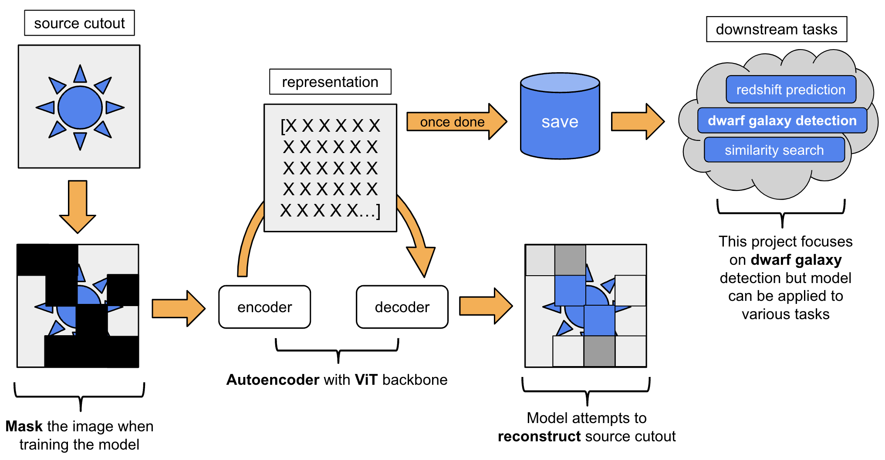
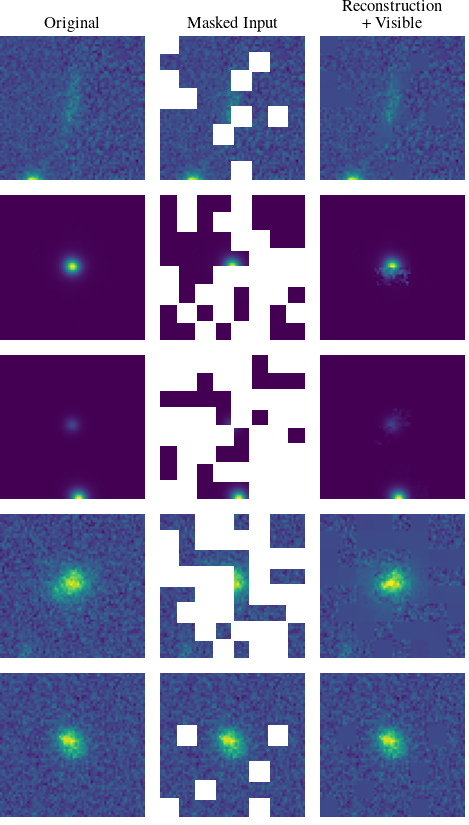
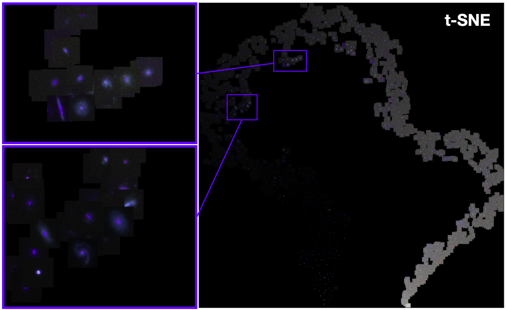
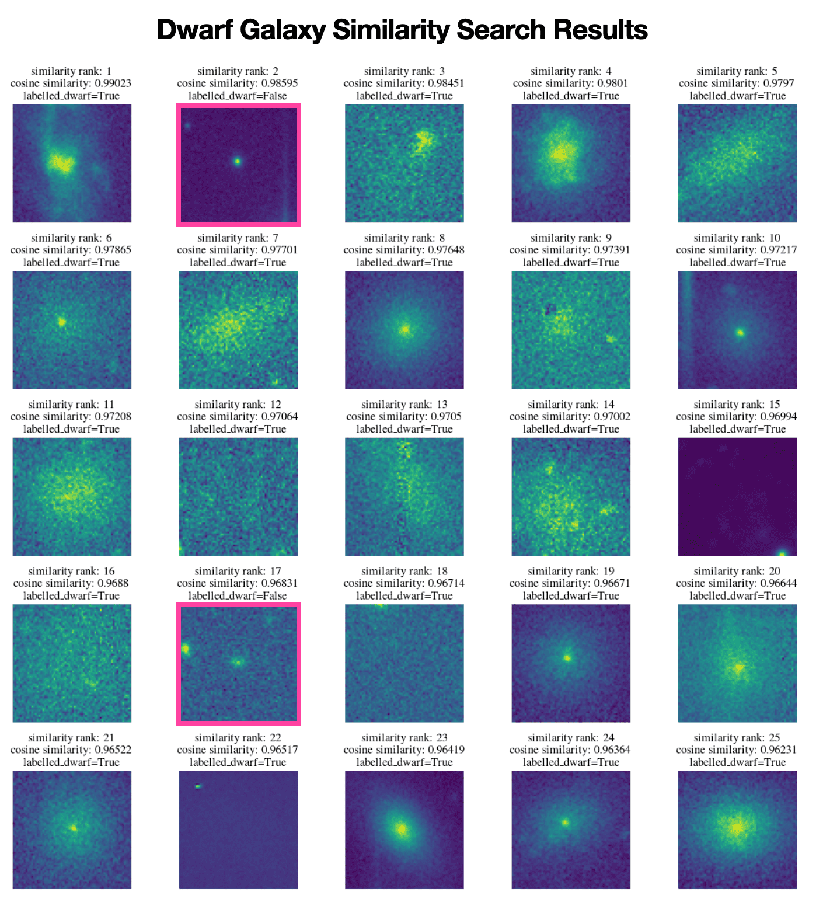

\* * * super pre-liminary work * * * 

## TL;DR

Masking images and making a model reconstruct the missing pixels is a meaningful task to get a deep learning model to learn some fundamental patterns in astronomy data. 

## Background

The Ultraviolet Near Infrared Optical Northern Survey (UNIONS) uses observations from three telescopes in Hawaii to investigate some of the most fundamental questions in astrophysics, such as determining the properties of dark matter and dark energy, as well as the growth of structure in the Universe. However, it is difficult to effectively search through and categorize UNIONS data to address these questions due to the volume of data produced. 

## Goal

This project aims to exploit advances in a sub-field of Machine Learning (ML) called Self-Supervised Learning (SSL), to train a model to produce astrophysically meaningful representations of astronomy observations. 

## Method

This work is done solely by training it on images of the sky, without the need for explicit labels indicating what source is being observed. When paired with a small number of labelled examples, these representations are useful in downstream tasks such as similarity searches for rare astronomical objects, or as inputs to a linear regression layer to predict redshifts. 

Most recently, a SSL masked image modeling method called SimMIM was implemented and evaluated on a specific use case of dwarf galaxy identification. 

## Results

The model is able to reconstruct the astronomy images pretty well:

More importantly, useful repesentations are learned!

Similar observations are clustered together (which is super useful for similarity searches):

Linear classifiers and regressors can be build on these embeddings to allow for learning from fewer labelled examples thaen is needed train a model of similar performance from scratch for a specific task. The example of a dwarf galaxy classifier is used and achieves 90\% accuracy at identifying known dwarf galaxy candidates with only 200 examples. 

Further, a similarity search is performed using the representations of just a handful of dwarf galaxies and 23 of the top 25 most similar sources are found to be dwarf galaxies:

## Conclusion 

These results prove this method is a promising avenue to explore for not only the discovery of more dwarf galaxies but various other tasks of interest to astronomers. 

## Code Availability

* Initial effort with MAE: [github.com/ashley-ferreira/AstroMASK](https://github.com/ashley-ferreira/AstroMASK)

* Most recent work with SimMIM: [github.com/teaghan/sky_embeddings](https://github.com/teaghan/sky_embeddings)

# pand of exmaple tools to put up here???